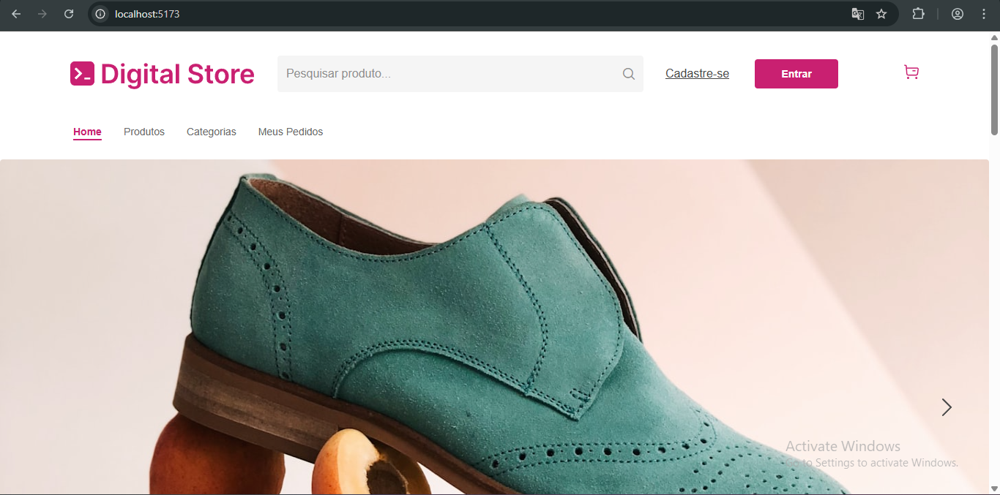
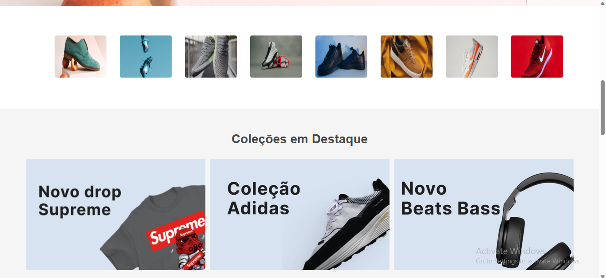
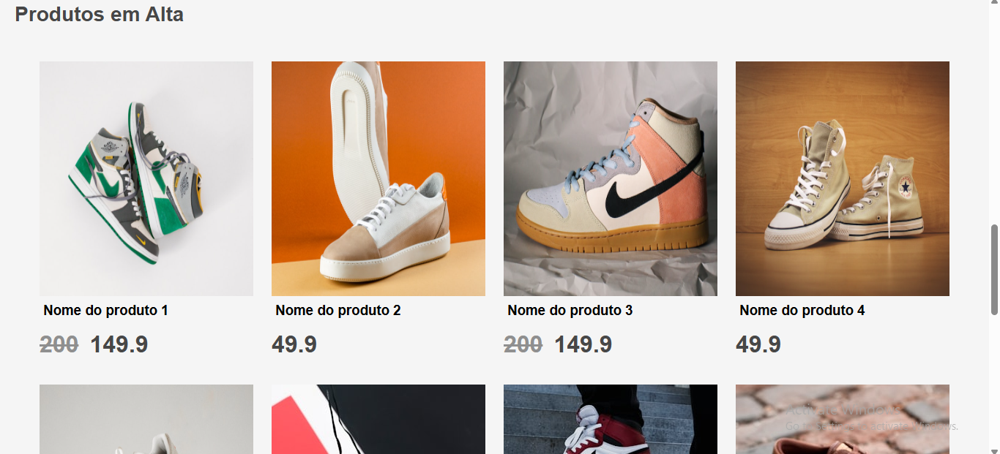
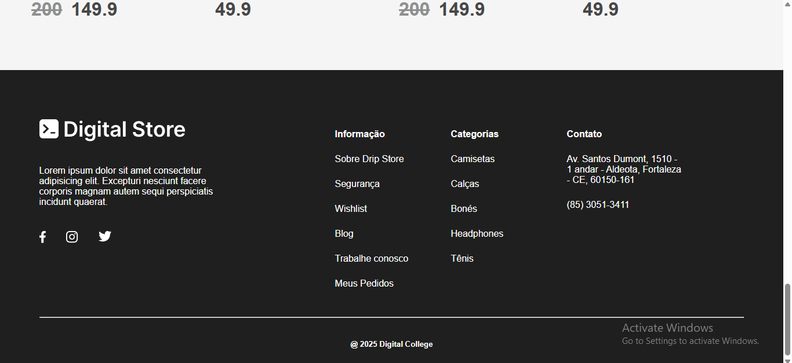

# PROJETO FINAL FRONT END GERAÇÃO TECH - 2025

- O objetivo do projeto é criar um um aplicativo Web simulando uma loja virtual, para venda de produtos, como tênis de vários modelos. Utiliza a biblioteca `React`, com auxílio da ferramenta `Vite`, com a linguagem JavaScript.

- A criação faz parte do projeto final Frontend do curso de Desenvolvedor Web Full Stack - Online - 2.0 - 2025, da Geração Tech, IEL.

- O projeto segue os requisitos do projeto `Digital Store`, da escola `Digital College`, disponibilizado no repositório do site do `GitHub`, e o modelo no site `Figma`:

- Link do repositório no GitHub:
```https://github.com/digitalcollegebr/projeto-digital-store/tree/main```

- Link do site Figma:
```https://www.figma.com/design/cfb4F7ZXMFQmvmTn3PKI4z/DRIP-STORE---DIGITAL-COLLEGE?node-id=22-30```


## Sobre o Aplicativo

- O aplicativo apresenta três páginas ao cliente (usuário), sendo a primeira a página principal. A segunda, com uma lista de produtos, com opções para filtrar (por enquanto não funcionais). E a terceira, com informações de um produto específico.

- As páginas possuem elementos comuns entre elas, como o cabeçalho (header) com a barra de menus, e o rodapé (footer) .

### 1 - Página Principal

<details>
  <summary><strong>Sobre</strong></summary>


- A página principal (Home Page) contém o cabeçalho (header) com a logo da loja fictícia, barra de pesquisa, botões para entrar como usuário (Login) e cadastro, e a barra de menus para as outras páginas. 

- Na seção principal, mostra uma galeria de imagens de produtos, uma seção com vários produtos, e no final um rodapé (footer) com informações da loja.

- Página Inicial - Parte 1


- Página Inicial - Parte 2



- Página Inicial - Parte 3



- Página Inicial - Parte 4



</details>

### 2 - Página da Lista de Produtos

<details>
  <summary><strong>Sobre</strong></summary>

- A segunda página mostra uma lista de produtos, com opções para filtrar (por enquanto não funcionais).

</details>

### 3 - Página de um Produto Específico

<details>
  <summary><strong>Sobre</strong></summary>

A terceira página contém informações de um produto específico.

</details>
