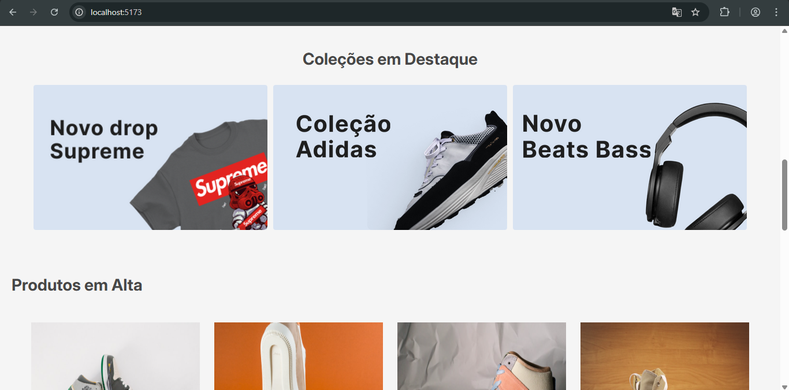
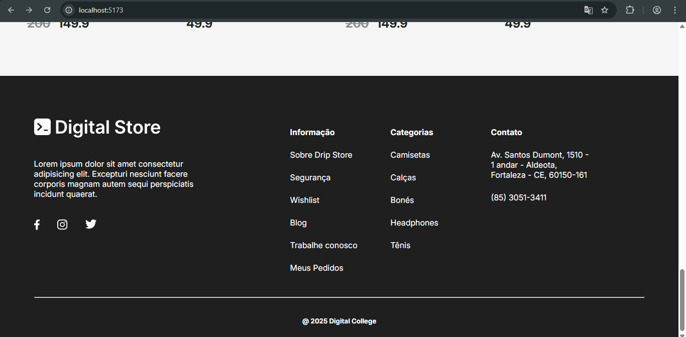
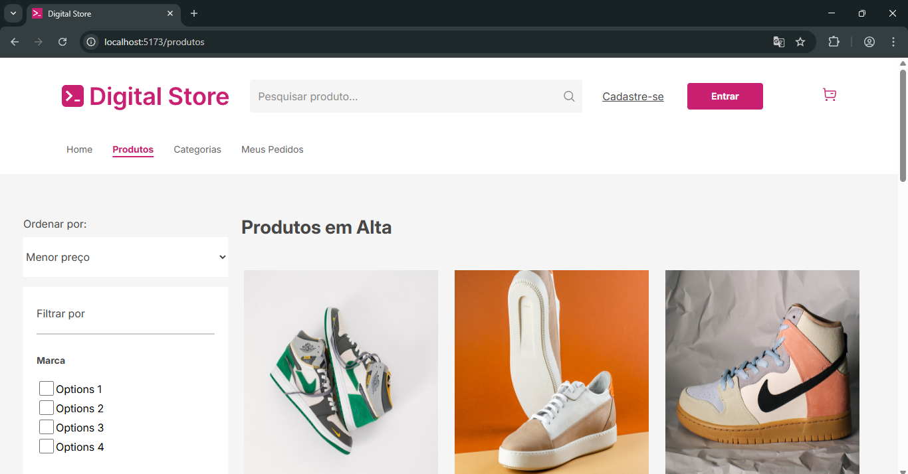
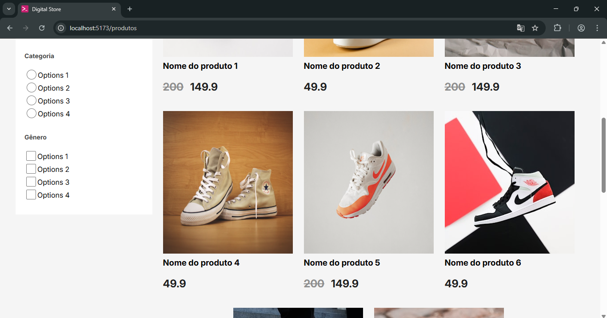
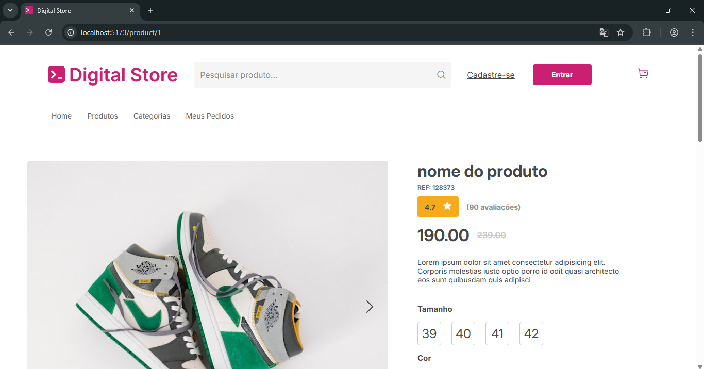

# PROJETO FINAL FRONT END GERAÇÃO TECH - 2025

O objetivo do projeto é criar um um aplicativo Web simulando uma loja virtual, para venda de produtos, como tênis de vários modelos. Utiliza a biblioteca `React`, com auxílio da ferramenta `Vite`, com a linguagem JavaScript.

A criação faz parte do projeto final Frontend do curso de Desenvolvedor Web Full Stack - Online - 2.0 - 2025, da Geração Tech, IEL.

O projeto segue os requisitos do projeto `Digital Store`, da escola `Digital College`, disponibilizado no repositório do site do `GitHub`, e o modelo no site `Figma`:

- Link do repositório no GitHub:
```https://github.com/digitalcollegebr/projeto-digital-store/tree/main```

- Link do site Figma:
```https://www.figma.com/design/cfb4F7ZXMFQmvmTn3PKI4z/DRIP-STORE---DIGITAL-COLLEGE?node-id=22-30```

## Linguagem, Ferramentas e Bibliotecas Utilizadas
- JavaScript
- React
- HTML e CSS (estilos dos componentes do React)
- Vite
- Node.js
- npm
- Axios
- Styled-components
- Prime React
- React Router Dom

## Sobre o Aplicativo

O aplicativo apresenta três páginas ao cliente (usuário), sendo a primeira a página principal. A segunda, com uma lista de produtos, com opções para filtrar (por enquanto não funcionais). E a terceira, com informações de um produto específico.

As páginas possuem elementos comuns entre elas, como o cabeçalho (header) com a barra de menus, e o rodapé (footer) .

<details>
  <summary><strong>Informações</strong></summary>

## Estrutura de pastas
A estrutura de pastas segue o modelo de organização recomendado pelo projeto `Digital Store`, acrescentando algumas pastas e arquivos, que são necessários para o funcionamento do aplicativo.

- Os arquivos `.gitignore`, `eslint.config.js`, `package-lock.json`, `package.json`, `vite.config.js`, são para o funcionamento do aplicativo, e instalados quando a framework `Vite` é instalado.

- O `index.html` é o arquivo principal, que vai receber todos os componentes criados. O `TODO.txt` contém lembretes utilizados para criação do projeto.
A pasta `src` contém os arquivos `main.jsx`, que substitui o elemento que tem o ID 'root' no `index.html`, pelo componente `App.jsx`, e o `App.jsx`, é responsável pelas rotas do site. Além dos arquivos CSS de cada um.

- Na pasta `src`, também estão as principais pastas do projeto, como a pasta `components`, com os arquivos dos componentes React. A pasta `pages` armazena os arquivos relacionados às páginas do site. A pasta `service` tem o arquivo `index.js`, que serve para importar o `Axios`, que ajuda a montar o URL para o recebimento de dados das requisições do banco de dados de teste. Na pasta `styles` contém os arquivos CSS para estilos dos componentes. A pasta `assets` possui arquivos de imagen com extensão `.svg`.

- A pasta `data` possui os arquivos utilizados como um banco de dados para teste, para verificar se o aplicativo que serve como Front End consegue receber dados entregues por um servidor (que não está no escopo do projeto).

- A `public` é a pasta onde se encontram as imagens usadas para os produtos da loja fictícia.
E na pasta `doc` estão as imagens usadas nesse `README.md`.

<details>
  <summary><strong>Estrutura</strong></summary>

```
|--- doc/
|--- public/
|--- src/
|--- |--- assets/
|--- |--- components/
|          |--- Header.jsx
|          |--- Footer.jsx
|--- |--- components/
|          |--- BarSearch.jsx
|          |--- BotoesConta.jsx
|          |--- BuyBox.jsx
|          |--- FilterGroup.jsx
|          |--- Footer.jsx
|          |--- Form.jsx
|          |--- Gallery.jsx
|          |--- Header.jsx
|          |--- HeaderFull.jsx
|          |--- HeaderMobile.jsx
|          |--- Information.jsx
|          |--- Logo.jsx
|          |--- Lupa.jsx
|          |--- MenuBar.jsx
|          |--- ProductCard.jsx
|          |--- ProductListing.jsx
|          |--- ProductOptions.jsx
|          |--- Section.jsx
|--- |--- data/
|          |--- dataFilter.json
|          |--- dataFooter.json
|          |--- dataGallery.json
|          |--- dataProduct.json
|          |--- dataProductListing.json
|          |--- dataProductView.json
|          |--- dataSection.json
|--- |--- pages/
|          |--- HomePage.jsx
|          |--- Layout.jsx
|          |--- NotFound.jsx
|          |--- ProductListingPage.jsx
|          |--- ProductView.jsx
|--- |--- service/
|          |--- index.js
|--- |--- styles/
|          |--- Hearder.css
|          |--- MenuBar.css
|          |--- ProductViewPage.css
|          |--- barSearch.css
|          |--- botoesConta.css
|          |--- buyBox.css
|          |--- filterGroup.css
|          |--- foote.css
|          |--- gallery.css
|          |--- hearderMobile.css
|          |--- homePage.css
|          |--- logo.css
|          |--- productCard.css
|          |--- productListing.css
|          |--- productListingPage.css
|          |--- productOptions.css

|--- |--- App.css
|--- |--- App.jsx
|--- |--- index.css
|--- |--- main.js
|--- .gitignore
|--- README.md
|--- TODO.txt
|--- eslint.config.js
|--- App.js
|--- index.html
|--- package-lock.json
|--- package.json
|--- vite.config.js

```
</details>

## Páginas

<details>
  <summary><strong>Informações</strong></summary>

### 1 - Página Principal

<details>
  <summary><strong>Sobre</strong></summary>


- A página principal (Home Page) contém o cabeçalho (header) com a logo da loja fictícia, barra de pesquisa, botões para entrar como usuário (Login) e cadastro, e a barra de menus para as outras páginas. 

- Na seção principal, mostra uma galeria de imagens de produtos, uma seção com vários produtos, e no final um rodapé (footer) com informações da loja.

- Página Inicial - Parte 1
 


- Página Inicial - Parte 2


- Página Inicial - Parte 3



- Página Inicial - Parte 4


- Página Inicial - Parte 5



</details>

### 2 - Página da Lista de Produtos

<details>
  <summary><strong>Sobre</strong></summary>

- A segunda página mostra uma lista de produtos, com opções para filtrar (não funcionais).

- Página de Produtos - Parte 1
  


- Página de Produtos - Parte 2
  


</details>

### 3 - Página de um Produto Específico

<details>
  <summary><strong>Sobre</strong></summary>

A terceira página contém informações de um produto específico.

- Página Product - Parte 1
  


- Página Product - Parte 2
  


- Página Product - Parte 3
  


</details>

</details>

</details>

## Autor

- GitHub: claussonlucas

## Contribuição

Alguns trechos de códigos foram feitos em parceria com o aluno Clailson Lucas, do curso Desenvolvedor Web Full Stack - Online - 2.0 - 2025, da Geração Tech.
- GitHub: [@clailson1](https://github.com/clailson1)

## Licença

O projeto segue o modelo do projeto `Digital Store`, da escola `Digital College`, disponibilizado no repositório do site do `GitHub`, e o modelo no site `Figma`:

- Link do repositório no GitHub: ```https://github.com/digitalcollegebr/projeto-digital-store/tree/main```

- Link do site Figma: ```https://www.figma.com/design/cfb4F7ZXMFQmvmTn3PKI4z/DRIP-STORE---DIGITAL-COLLEGE?node-id=22-30```
